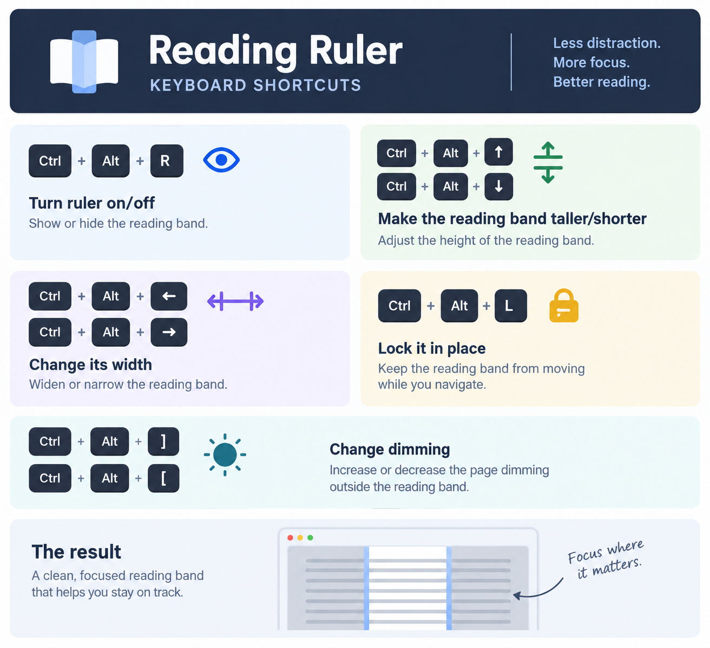

# Reading Ruler

A click-through dimming overlay for Windows. The screen dims; a clear reading
band follows your mouse. Everything underneath keeps working — clicks, typing,
scrolling and hover all pass straight through.

It sits above whatever you are using: a browser, Word, Outlook, Excel, a PDF, a
Citrix or remote-desktop session. It never reads, parses, or reformats text, so
it does not care what the application is.

One file, 83 KB, no installer and no runtime.

## Why

Most reading-support tools have to understand the text before they can help.
They reflow it, re-render it, or run inside a browser. That rules out most of
the software people actually read in all day.

This one is deliberately ignorant. It only knows where the mouse is, which
turns out to be enough to act as a reading ruler — and it means it works
everywhere, with no integration, no permissions, and no extension.

## Install

Download `ReadingRuler.exe` from
[Releases](https://github.com/tannimon/reading-ruler/releases) and double-click
it. Put it anywhere you like; it needs nothing beside it.

Windows will warn that the publisher is unknown, because the executable is
unsigned. Click **More info** → **Run anyway**.

## Controls

| Shortcut | Action |
| --- | --- |
| `Ctrl + Alt + R` | Ruler on / off |
| `Ctrl + Alt + Q` | Quit |
| `Ctrl + Alt + ↑` / `↓` | Taller / shorter band |
| `Ctrl + Alt + ←` / `→` | Narrower / wider band |
| `Ctrl + Alt + F` | Back to full screen width |
| `Ctrl + Alt + L` | Lock the band in place |
| `Ctrl + Alt + ]` / `[` | More / less dimming |



Narrowing the band turns it into a reading window that tracks the cursor
horizontally as well as vertically.

There is also a tray icon. Left-click toggles, right-click gives lock and quit.
Windows hides new tray icons under the `^` chevron by default — Settings →
Personalization → Taskbar → Other system tray icons will pin it beside the
clock.

Running `ReadingRuler.exe` while it is already running offers to quit it. That
is the exit that needs no shortcut and no tray icon.

Band size and dim level persist to `%APPDATA%\ReadingRuler\settings.ini`.

`Esc` is deliberately not bound. A global Esc hook would swallow the key in
every other application, breaking dialogs and cell editing everywhere.

## How it works

A single layered, topmost, non-activating window covers the whole virtual
desktop, filled flat black at a uniform alpha:

```
WS_EX_LAYERED | WS_EX_TRANSPARENT | WS_EX_TOOLWINDOW | WS_EX_NOACTIVATE | WS_EX_TOPMOST
```

The clear band is never painted. It is a hole cut out of the **window region**
with `CombineRgn(RGN_DIFF)`, which has three consequences worth the trouble:
moving it is one `SetWindowRgn` call rather than a full-screen repaint, the
colours underneath are entirely unaltered, and input passes through the band
because there is nothing there to hit — not because a style flag is behaving.

Shortcuts go through `RegisterHotKey`. Where another program has already
claimed a combination, a `WH_KEYBOARD_LL` hook handles that specific
combination as a fallback and passes every other keystroke through untouched.
Which shortcuts registered, and which were refused, is recorded in
`%APPDATA%\ReadingRuler\log.txt`.

Only one instance runs at a time, so a stray double-click cannot stack two
overlays and double the dimming.

## Building

The source is a single `.cpp` file. Nothing beyond the Windows SDK is required
— no third-party libraries, no package manager.

```
build_msvc.bat     Visual Studio, from a Developer Command Prompt
build_mingw.bat    MinGW-w64 or MSYS2
```

Tagged pushes build the same binary in CI and attach it to a release. See
`.github/workflows/release.yml`.

## Configuration

Constants at the top of `ReadingRuler.cpp`:

| Setting | Meaning |
| --- | --- |
| `BAND_DEFAULT` | Starting band height |
| `DIM_DEFAULT` | `0.10` to `0.92` |
| `BAND_STEP` / `WIDTH_STEP` | How far each keypress moves |
| `WIDTH_MIN` | Narrowest the band can go |
| `EDGE_LINES` | Faint outline around the band |
| `POLL_MS` | Cursor sampling interval |

Delete `settings.ini` to return to defaults.

## Known limits

- Will not draw over a UAC prompt, the lock screen, or a true full-screen
  exclusive application. Windows blocks that by design; borderless full screen
  is fine.
- All monitors dim together, since the overlay spans the virtual desktop as one
  surface.
- Windows only. The approach depends on Win32 extended window styles.

## Roadmap

- Per-monitor overlays, so a second screen can stay undimmed
- A mode that pins the band horizontally while leaving vertical free
- Text-line snapping via UI Automation, centring the band on the nearest line
  rather than the exact cursor position
- Start with Windows

## License

MIT © 2026 Tanni Monroe
